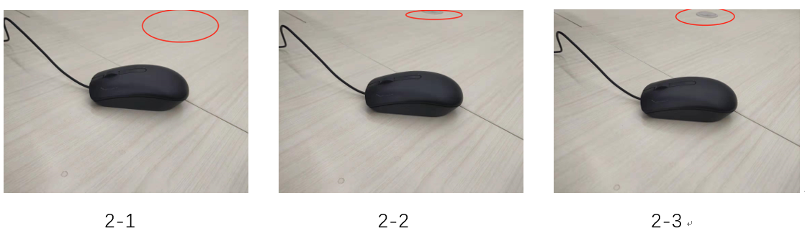

# 基于感知哈希的图片相似检测
>img存放测试图片  
>result感知哈希结果即图片对比 
>compare.py感知哈希对比代码 
* 每次测试result-1.png是测试图片对比。result-1-25.png是感知哈希相似度的结果，其中'25'表示汉明距离阈值。
* 为了减少变量，每次测试图片使用相同的分辨率。汉明距离的阈值都是25，但不影响相似度测试结果，每次输出汉明距离即是否相似的结果。
* 每次输出结果的顺序都是:n-1与n-2,n-2和n-3,n-1和n-3
## 参考学术文献
[基于图像内容认证的感知哈希算法的研究:第三章](http://www.wanfangdata.com.cn/details/detail.do?_type=degree&id=Y1725092)  
[基于人类视觉系统的图像感知哈希算法](https://wenku.baidu.com/view/e476ea0290c69ec3d5bb75d7.html)
## 实现参考文献
[基于感知哈希算法的相似图片识别](https://miketech.it/perceptual-hash-algorithm)   
[四种图像哈希方式代码示例](https://cloud.tencent.com/developer/article/1011084)    
[三种感知哈希算法的原理](https://www.jianshu.com/p/ad7131f7999b)
* 总结：  
aHash：平均值哈希。速度比较快，但是常常不太精确。
pHash：感知哈希。精确度比较高，但是速度方面较差一些。
dHash：差异值哈希。Amazing！精确度较高，且速度也非常快。
## 实现原理
1. 缩小尺寸  
32 * 32是一个较好的大小，这样方便DCT计算
2. 简化色彩  
即转化为灰度图，把缩放后的图片转化为256阶的灰度图。
3. 计算DCT  
DCT把图片分离成分率的集合
4. 缩小DCT  
DCT计算后的矩阵是32 * 32，保留左上角的8 * 8，这些代表的图片的最低频率
5. 计算平均值  
计算缩小DCT后的所有像素点的平均值。
6. 进一步减小DCT  
大于平均值记录为1，反之记录为0.
7. 得到信息指纹  
组合64个信息位，顺序随意保持一致性
* 获得信息位的顺序随意，但需前后保持一致性
8. 最后比对两张图片的指纹  
获得汉明距离，根据设置的距离阈值来判断两个图片是否相似
* 汉明距离是使用在数据传输差错控制编码里面的，汉明距离是一个概念，它表示两个（相同长度）字对应位不同的数量，我们以d（x,y）表示两个字x,y之间的汉明距离。对两个字符串进行异或运算，并统计结果为1的个数，那么这个数就是汉明距离。例如：1011101与1001001之间的汉明距离是2。2143896与2233796之间的汉明距离是3。"toned"与"roses"之间的汉明距离是3。
* 识别准确度与设置的距离阈值有关，阈值越小说明差别越小，相似度越高，阈值越大说明差别越大，相似度越低

* 比如当alpha=25时，可以看到三个图两两相似，而阈值15时2-1与2-2相似，2-1与2-3不相似，2-2与2-3不相似

* 因此算法优缺点：识别精准(比如例子8，及时是很小的差别也能识别出有不同)，由于阈值的大小决定是否相似，有很强的主观性，如果阈值较大，肉眼可见的不同却识别不出。
